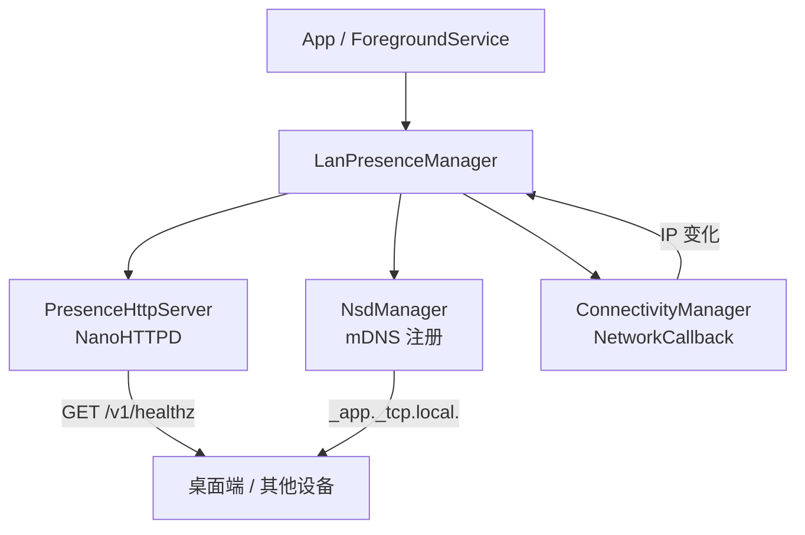

# lan-beacon

> 让桌面端在局域网里"看见"你的 Android 设备 / Tiny LAN presence beacon for Android.

[](#)
[](#)
[](LICENSE)

lan-beacon 是一个面向 Android 的轻量级"局域网在场广播"库。它在你的 App 里嵌入一个迷你 HTTP 服务（仅一个 `/v1/healthz` 端点）+ mDNS 服务注册，让同一局域网内的桌面端 / 其他设备可以零配置地探测设备是否在场，常用于：

- 桌面伴侣应用判断手机"在不在身边"
- 智能家居/自动化场景的设备状态感知
- 任何需要"局域网内轻量心跳"的场景

**核心特性**

- 🪶 **极轻量**：基于 NanoHTTPD，无第三方网络框架，APK 体积增量约 50 KB
- 🔒 **默认安全**：HTTP 端点仅响应 RFC1918 私有网段请求，公网来源直接 403
- 📡 **零配置发现**：自动 mDNS 广播（`_<app>._tcp.local.`），桌面端 Bonjour/Avahi 即可发现
- 🔁 **自动重绑**：监听 WiFi 变化，IP 切换后自动重启 server + 重注册 mDNS
- 🧩 **零业务耦合**：纯 `Context` 输入，不依赖 DataStore / Room / DI 框架
- 🧊 **协程友好**：通过 `StateFlow` 暴露当前 IP 与运行状态

---

## 安装

### Gradle (JitPack)

在工程根 `settings.gradle.kts` 加入 JitPack：

```kotlin
dependencyResolutionManagement {
    repositories {
        mavenCentral()
        maven { url = uri("https://jitpack.io") }
    }
}
```

App 模块 `build.gradle.kts`：

```kotlin
dependencies {
    implementation("com.github.szgenle:lan-beacon:0.1.0")
}
```

### 手动集成

把本仓库 `android/` 目录整个拷到你的多模块工程作为子模块（例如重命名为 `core/lanbeacon/`），在 `settings.gradle.kts` 添加 `include(":core:lanbeacon")` 即可。模块目录建议用连写 `lanbeacon`（避免 Gradle 引用时短横线带来的转义麻烦）。

---

## 快速开始

### 1. 声明权限

`AndroidManifest.xml`：

```xml
<uses-permission android:name="android.permission.INTERNET" />
<uses-permission android:name="android.permission.ACCESS_NETWORK_STATE" />
<uses-permission android:name="android.permission.ACCESS_WIFI_STATE" />
```

> 库本身不强制声明权限，由集成方按需声明。

### 2. 在前台 Service 中持有实例

为了避免被系统回收，强烈建议在前台 Service 中托管：

```kotlin
class MyForegroundService : Service() {

    private var lan: LanPresenceManager? = null

    override fun onStartCommand(intent: Intent?, flags: Int, startId: Int): Int {
        startForeground(NOTIFICATION_ID, buildNotification())

        val versionName = packageManager.getPackageInfo(packageName, 0).versionName.orEmpty()
        lan = LanPresenceManager(this).also {
            it.start(
                port = 47821,
                appName = "myapp",
                appVersion = versionName,
                serviceType = "_myapp._tcp.",
                serviceName = "myapp",
            )
        }
        return START_STICKY
    }

    override fun onDestroy() {
        lan?.stop()
        super.onDestroy()
    }
}
```

### 3. 桌面端探测

```bash
# 1) 通过 mDNS 发现设备 IP（macOS）
#    把 _myapp._tcp 替换为你启动时传入的 serviceType；
#    如果未自定义，使用默认值 _lanbeacon._tcp
dns-sd -B _myapp._tcp

# 2) 直接 HTTP 探测
curl http://<device-ip>:47821/v1/healthz
# => {"app":"myapp","version":"1.2.3","ts":1717225600000}
```

---

## API 参考

### `LanPresenceManager`

| 成员 | 说明 |
|---|---|
| `start(port, appName, appVersion, serviceType, serviceName)` | 启动 HTTP server + mDNS 注册 + 网络监听。除 `appVersion` 外其它参数均有默认值。 |
| `stop()` | 停止全部子组件并释放资源。 |
| `currentLanIp: StateFlow<String?>` | 当前 WiFi LAN IPv4 地址；`null` 表示未连接或未启动。 |
| `isRunning: StateFlow<Boolean>` | 运行状态。 |

### HTTP 端点

| Method | Path | 响应 |
|---|---|---|
| `GET` | `/v1/healthz` | `200 application/json` `{"app":"<appName>","version":"<appVersion>","ts":<unix-ms>}` |
| 其他 | 任意 | `404 Not Found` |
| 任意 | 任意 | 来源非 RFC1918 → `403 Forbidden` |

### mDNS

- 协议：DNS-SD over mDNS（Android `NsdManager`）
- 默认服务类型：`_lanbeacon._tcp.`，强烈建议在 `start()` 中覆盖为你自己的 `_<app>._tcp.`
- TXT 记录：暂未携带（v0.1）

---

## 安全模型

lan-beacon 的设计前提：**端点只对局域网可见，不暴露认证机制**。

- ✅ Handler 层基于 `InetAddress.isSiteLocalAddress / isLinkLocalAddress / isLoopbackAddress` 过滤来源
- ✅ 仅响应 `10.0.0.0/8`、`172.16.0.0/12`、`192.168.0.0/16`、`169.254.0.0/16`、`127.0.0.0/8`
- ❌ 不提供 TLS（局域网内可信场景）
- ❌ 不提供 Token 鉴权（同网段被视为已授权）
- ⚠️ 如果你的使用场景**有不可信用户接入同一局域网**（如咖啡馆 WiFi），请勿直接使用本库

---

## 架构概览



---

## FAQ

**Q: 为什么不直接用 Ktor / OkHttp MockWebServer？**
A: Ktor 体积约 1.5 MB+，且依赖庞大；本库目标是"加进来不到 100 KB"。NanoHTTPD 单 jar 约 50 KB。

**Q: 应用在后台被杀掉怎么办？**
A: 必须放到前台 Service 中托管。lan-beacon 本身不管理 Service 生命周期，但 README 给出了模板。

**Q: 支持 IPv6 吗？**
A: 当前版本仅返回 IPv4，mDNS 由系统协议栈处理，IPv6 可达但 `currentLanIp` 不暴露。

**Q: 能否运行多个实例 / 多个端口？**
A: 当前一个 `LanPresenceManager` 实例只管理一个 server，但你可以创建多个实例使用不同端口（不推荐）。

**Q: 端口被占用怎么办？**
A: `start()` 会在内部捕获异常并打 Log，`isRunning` 仍为 `false`。建议集成方在启动失败时回退到其它端口或提示用户。

---

## Roadmap

- [ ] 0.2：可选 Token 鉴权（应对不可信局域网场景）
- [ ] 0.2：mDNS TXT 记录承载更多元信息（设备名、能力声明）
- [ ] 0.3：可插拔路由（让集成方扩展 healthz 之外的端点）
- [ ] 0.3：IPv6 支持
- [ ] 0.x：桌面端配套 Kotlin Multiplatform / Rust SDK

---

## 许可证

Apache License 2.0 — 详见 [LICENSE](LICENSE)。

本项目使用了以下开源组件：

- [NanoHTTPD](https://github.com/NanoHttpd/nanohttpd) (BSD 3-Clause)
- [Kotlinx Coroutines](https://github.com/Kotlin/kotlinx.coroutines) (Apache 2.0)

---

## 相关项目

- [agentpost](https://github.com/szgenle/agentpost) — lan-beacon 的发源地，一个把邮件桥接到任务流的 Android 应用
