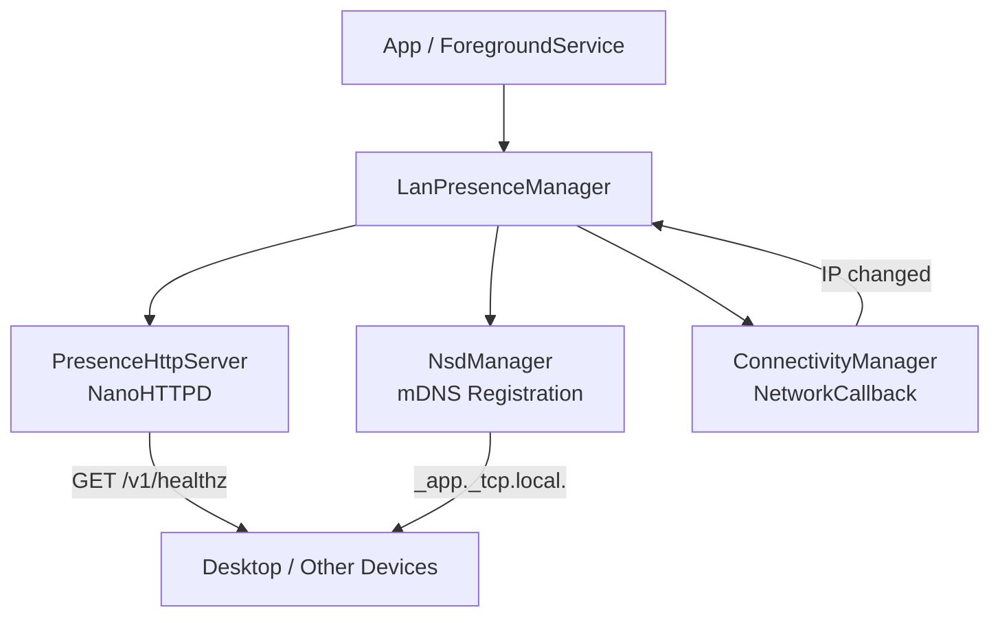

# lan-beacon

[中文文档](README_zh.md)

> Zero-config LAN presence detection — let desktop apps know your Android device is nearby.

[](https://jitpack.io/#szgenle/lan-beacon)
[](#)
[](LICENSE)

lan-beacon is a lightweight LAN presence broadcasting library for Android. It embeds a tiny HTTP server (single `/v1/healthz` endpoint) + mDNS service registration in your app, enabling desktops and other devices on the same network to detect device presence with zero configuration.

**Use cases:**
- Desktop companion apps detecting if your phone is "nearby"
- Smart home / automation device state awareness
- Any scenario requiring lightweight LAN heartbeats

**Key features:**
- Ultralight — based on NanoHTTPD, ~50 KB APK footprint
- Secure by default — only responds to RFC 1918 private network requests (403 for public IPs)
- Zero-config discovery — automatic mDNS broadcast (`_<app>._tcp.local.`)
- Auto-rebind — monitors WiFi changes, auto-restarts on IP switch
- Zero business coupling — pure `Context` input, no DataStore/Room/DI dependency
- Coroutine-friendly — exposes state via `StateFlow`

---

## Installation

### Gradle (JitPack)

Add JitPack to your root `settings.gradle.kts`:

```kotlin
dependencyResolutionManagement {
    repositories {
        mavenCentral()
        maven { url = uri("https://jitpack.io") }
    }
}
```

In your app module `build.gradle.kts`:

```kotlin
dependencies {
    implementation("com.github.szgenle.lan-beacon:lib:0.1.0")
}
```

### Manual integration

Copy `android/lib/` into your multi-module project (e.g. rename to `core/lanbeacon/`), then add `include(":core:lanbeacon")` to `settings.gradle.kts`.

---

## Quick Start

### 1. Permissions

The library manifest declares all required permissions (auto-merged via AGP). No additional setup needed.

For `targetSdk >= 34` (Android 14+), declare `foregroundServiceType` in your Service registration:

```xml
<service
    android:name=".MyBeaconService"
    android:foregroundServiceType="connectedDevice"
    android:exported="false" />
```

### 2. Extend BeaconService (recommended)

The simplest integration — subclass `BeaconService` and implement two methods:

```kotlin
class MyBeaconService : BeaconService() {

    override fun provideConfig() = BeaconConfig(
        port = 47821,
        appName = "myapp",
        appVersion = BuildConfig.VERSION_NAME,
        serviceType = "_myapp._tcp.",
        serviceName = "myapp-beacon",
    )

    override fun buildNotification(state: BeaconState): Notification {
        val channelId = "beacon_channel"
        if (Build.VERSION.SDK_INT >= Build.VERSION_CODES.O) {
            val channel = NotificationChannel(channelId, "Beacon", NotificationManager.IMPORTANCE_LOW)
            getSystemService(NotificationManager::class.java).createNotificationChannel(channel)
        }
        val text = when (state) {
            is BeaconState.Running -> "Broadcasting (${state.lanIp})"
            is BeaconState.NetworkLost -> "Waiting for network..."
            is BeaconState.Error -> "Error: ${state.message}"
            else -> "Starting..."
        }
        return NotificationCompat.Builder(this, channelId)
            .setSmallIcon(R.drawable.ic_beacon)
            .setContentTitle("LAN Beacon")
            .setContentText(text)
            .setOngoing(true)
            .build()
    }
}
```

Start / stop:

```kotlin
// Start
ContextCompat.startForegroundService(context, Intent(context, MyBeaconService::class.java))

// Stop
context.stopService(Intent(context, MyBeaconService::class.java))
```

### 3. Observe state (optional)

```kotlin
lifecycleScope.launch {
    beaconManager.state.collect { state ->
        when (state) {
            is BeaconState.Running -> showConnected(state.lanIp)
            is BeaconState.NetworkLost -> showDisconnected()
            is BeaconState.Error -> showError(state.message)
            else -> { /* Starting / Idle */ }
        }
    }
}
```

### 4. Desktop detection

```bash
# Via mDNS (macOS)
dns-sd -B _myapp._tcp

# Direct HTTP probe
curl http://<device-ip>:47821/v1/healthz
# => {"app":"myapp","version":"1.2.3","ts":1717225600000}
```

---

## API Reference

### `LanPresenceManager`

| Member | Description |
|--------|-------------|
| `start(config: BeaconConfig)` | Start HTTP server + mDNS registration + network monitoring. |
| `stop()` | Stop all components and release resources. State returns to Idle. |
| `state: StateFlow<BeaconState>` | Real-time state (Idle / Starting / Running / NetworkLost / Error). |
| `currentLanIp: String?` | Convenience: returns LAN IP when Running, null otherwise. |
| `isRunning: Boolean` | Convenience: equivalent to `state.value is Running`. |

### `BeaconState`

| State | Meaning |
|-------|---------|
| `Idle` | Not started / stopped |
| `Starting` | Starting up |
| `Running(lanIp, port)` | Broadcasting normally |
| `NetworkLost` | WiFi disconnected, waiting for recovery |
| `Error(message, cause)` | Error, integrator should handle |

### `BeaconService` (abstract base class)

| Member | Description |
|--------|-------------|
| `provideConfig(): BeaconConfig` | **Required** — return beacon configuration |
| `buildNotification(state): Notification` | **Required** — build foreground notification |
| `notificationId: Int` | **Override** — notification ID, default 47821 |
| `onStateChanged(state)` | **Override** — state change callback, updates notification by default |

### HTTP Endpoint

| Method | Path | Response |
|--------|------|----------|
| `GET` | `/v1/healthz` | `200 application/json` `{"app":"<appName>","version":"<appVersion>","ts":<unix-ms>}` |
| Other | Any | `404 Not Found` |
| Any | Any | Non-RFC1918 source → `403 Forbidden` |

---

## Security Model

lan-beacon is designed with the assumption that **endpoints are only visible within the LAN**.

- Filters source IP via `InetAddress.isSiteLocalAddress / isLinkLocalAddress / isLoopbackAddress`
- Only responds to `10.0.0.0/8`, `172.16.0.0/12`, `192.168.0.0/16`, `169.254.0.0/16`, `127.0.0.0/8`
- No TLS (trusted LAN scenario)
- No token authentication (same subnet = authorized)
- **Do not use this library if untrusted users share your network** (e.g. public WiFi)

---

## Architecture



---

## Repository Structure

This repository uses a **monorepo** layout — top-level is platform-neutral, each platform is an independent sub-project:

```
lan-beacon/
├── protocol/        # Protocol specification (single source of truth)
│   └── SPEC.md       # lan-beacon protocol v1
├── android/         # Android Gradle project (Beacon broadcaster)
│   └── lib/          # Published module, Kotlin sources
├── godot/           # Godot 4.x desktop (Scanner discovery plugin)
│   └── addons/lan_beacon/  # GDScript plugin, copy to target project
└── Makefile         # Top-level entry, <platform>-<action> naming
```

**Protocol docs**: [protocol/SPEC.md](protocol/SPEC.md) — defines mDNS registration format, HTTP endpoints, JSON schema, and presence/absence detection logic. Read this before implementing a new platform.

Open `android/` as your Android Studio / IntelliJ project root (not the repo root).

---

## FAQ

**Q: Why not Ktor / OkHttp MockWebServer?**
A: Ktor is ~1.5 MB+ with heavy dependencies. This library targets < 100 KB total. NanoHTTPD is ~50 KB.

**Q: What if the app is killed in the background?**
A: You must host it in a ForegroundService. lan-beacon provides `BeaconService` as a ready-to-use base class.

**Q: IPv6 support?**
A: Current version only exposes IPv4. mDNS is handled by the system stack (IPv6 reachable), but `currentLanIp` doesn't expose it.

**Q: Can I run multiple instances / ports?**
A: Each `LanPresenceManager` manages one server. You can create multiple instances with different ports (not recommended).

**Q: What if the port is occupied?**
A: `start()` catches the exception internally. State transitions to `Error`. Integrators should fallback to another port or alert the user.

---

## Roadmap

- [ ] 0.2: Optional token auth (for untrusted LAN scenarios)
- [ ] 0.2: mDNS TXT records carrying metadata (device name, capabilities)
- [ ] 0.3: Pluggable routing (custom endpoints beyond healthz)
- [ ] 0.3: IPv6 support
- [ ] 0.x: Desktop SDK (Kotlin Multiplatform / Rust)

---

## License

Apache License 2.0 — see [LICENSE](LICENSE).

Third-party components:
- [NanoHTTPD](https://github.com/NanoHttpd/nanohttpd) (BSD 3-Clause)
- [Kotlinx Coroutines](https://github.com/Kotlin/kotlinx.coroutines) (Apache 2.0)
