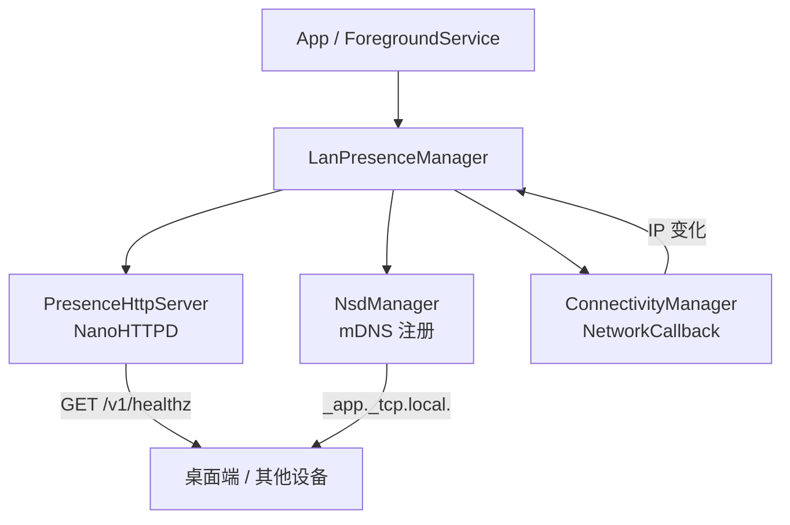

# lan-beacon

[English](README.md)

> 让桌面端在局域网里"看见"你的 Android 设备 / Tiny LAN presence beacon for Android.

[](https://jitpack.io/#szgenle/lan-beacon)
[](#)
[](LICENSE)

lan-beacon 是一个面向 Android 的轻量级"局域网在场广播"库。它在你的 App 里嵌入一个迷你 HTTP 服务（仅一个 `/v1/healthz` 端点）+ mDNS 服务注册，让同一局域网内的桌面端 / 其他设备可以零配置地探测设备是否在场，常用于：

- 桌面伴侣应用判断手机"在不在身边"
- 智能家居/自动化场景的设备状态感知
- 任何需要"局域网内轻量心跳"的场景

**核心特性**

- 🪶 **极轻量**：基于 NanoHTTPD，无第三方网络框架，APK 体积增量约 50 KB
- 🔒 **默认安全**：HTTP 端点仅响应 RFC1918 私有网段请求，公网来源直接 403
- 📡 **零配置发现**：自动 mDNS 广播（`_<app>._tcp.local.`），桌面端 Bonjour/Avahi 即可发现
- 🔁 **自动重绑**：监听 WiFi 变化，IP 切换后自动重启 server + 重注册 mDNS
- 🧩 **零业务耦合**：纯 `Context` 输入，不依赖 DataStore / Room / DI 框架
- 🧊 **协程友好**：通过 `StateFlow` 暴露当前 IP 与运行状态

---

## 安装

### Gradle (JitPack)

在工程根 `settings.gradle.kts` 加入 JitPack：

```kotlin
dependencyResolutionManagement {
    repositories {
        mavenCentral()
        maven { url = uri("https://jitpack.io") }
    }
}
```

App 模块 `build.gradle.kts`：

```kotlin
dependencies {
    implementation("com.github.szgenle.lan-beacon:lib:0.1.0")
}
```

### 手动集成

把本仓库 `android/lib/` 目录拷到你的多模块工程作为子模块（如重命名为 `core/lanbeacon/`），在 `settings.gradle.kts` 添加 `include(":core:lanbeacon")` 即可。模块目录建议用连写 `lanbeacon`（避免 Gradle 引用时短横线带来的转义麻烦）。

---

## 快速开始

### 1. 声明权限

库 manifest 已声明所需权限（merge 后自动生效），集成方无需额外添加。

如果你的 `targetSdk >= 34`（Android 14+），需确保 Service 注册时声明 `foregroundServiceType`：

```xml
<service
    android:name=".MyBeaconService"
    android:foregroundServiceType="connectedDevice"
    android:exported="false" />
```

### 2. 继承 BeaconService（推荐）

最简集成方式——继承 `BeaconService`，只需实现两个方法：

```kotlin
class MyBeaconService : BeaconService() {

    override fun provideConfig() = BeaconConfig(
        port = 47821,
        appName = "myapp",
        appVersion = BuildConfig.VERSION_NAME,
        serviceType = "_myapp._tcp.",
        serviceName = "myapp-beacon",
    )

    override fun buildNotification(state: BeaconState): Notification {
        // 创建 NotificationChannel（Android O+）
        val channelId = "beacon_channel"
        if (Build.VERSION.SDK_INT >= Build.VERSION_CODES.O) {
            val channel = NotificationChannel(channelId, "Beacon", NotificationManager.IMPORTANCE_LOW)
            getSystemService(NotificationManager::class.java).createNotificationChannel(channel)
        }
        val text = when (state) {
            is BeaconState.Running -> "广播中 (${state.lanIp})"
            is BeaconState.NetworkLost -> "等待网络..."
            is BeaconState.Error -> "错误: ${state.message}"
            else -> "启动中..."
        }
        return NotificationCompat.Builder(this, channelId)
            .setSmallIcon(R.drawable.ic_beacon)
            .setContentTitle("LAN Beacon")
            .setContentText(text)
            .setOngoing(true)
            .build()
    }
}
```

启停：

```kotlin
// 启动
ContextCompat.startForegroundService(context, Intent(context, MyBeaconService::class.java))

// 停止
context.stopService(Intent(context, MyBeaconService::class.java))
```

### 3. 观察状态（可选）

```kotlin
// 在 Activity/ViewModel 中
lifecycleScope.launch {
    beaconManager.state.collect { state ->
        when (state) {
            is BeaconState.Running -> showConnected(state.lanIp)
            is BeaconState.NetworkLost -> showDisconnected()
            is BeaconState.Error -> showError(state.message)
            else -> { /* Starting / Idle */ }
        }
    }
}
```

### 3. 桌面端探测

```bash
# 1) 通过 mDNS 发现设备 IP（macOS）
#    把 _myapp._tcp 替换为你启动时传入的 serviceType；
#    如果未自定义，使用默认值 _lanbeacon._tcp
dns-sd -B _myapp._tcp

# 2) 直接 HTTP 探测
curl http://<device-ip>:47821/v1/healthz
# => {"app":"myapp","version":"1.2.3","ts":1717225600000}
```

---

## API 参考

### `LanPresenceManager`

| 成员 | 说明 |
|---|---|
| `start(config: BeaconConfig)` | 启动 HTTP server + mDNS 注册 + 网络监听。 |
| `stop()` | 停止全部子组件并释放资源，状态回到 Idle。 |
| `state: StateFlow<BeaconState>` | 实时运行状态（Idle / Starting / Running / NetworkLost / Error）。 |
| `currentLanIp: String?` | 便捷属性：Running 时返回 LAN IP，否则 null。 |
| `isRunning: Boolean` | 便捷属性：等价于 `state.value is Running`。 |

### `BeaconState`

| 状态 | 含义 |
|---|---|
| `Idle` | 未启动 / 已停止 |
| `Starting` | 正在启动中 |
| `Running(lanIp, port)` | 正常广播中 |
| `NetworkLost` | WiFi 断开，等待恢复 |
| `Error(message, cause)` | 错误，需集成方处理 |

### `BeaconService`（抽象基类）

| 成员 | 说明 |
|---|---|
| `provideConfig(): BeaconConfig` | 【必须实现】返回 beacon 配置 |
| `buildNotification(state): Notification` | 【必须实现】构建前台通知 |
| `notificationId: Int` | 【可覆盖】通知 ID，默认 47821 |
| `onStateChanged(state)` | 【可覆盖】状态变化回调，默认更新通知 |

### HTTP 端点

| Method | Path | 响应 |
|---|---|---|
| `GET` | `/v1/healthz` | `200 application/json` `{"app":"<appName>","version":"<appVersion>","ts":<unix-ms>}` |
| 其他 | 任意 | `404 Not Found` |
| 任意 | 任意 | 来源非 RFC1918 → `403 Forbidden` |

### mDNS

- 协议：DNS-SD over mDNS（Android `NsdManager`）
- 服务类型：由 `BeaconConfig.serviceType` 指定（如 `_myapp._tcp.`），无默认值
- TXT 记录：暂未携带（v0.1）

---

## 安全模型

lan-beacon 的设计前提：**端点只对局域网可见，不暴露认证机制**。

- ✅ Handler 层基于 `InetAddress.isSiteLocalAddress / isLinkLocalAddress / isLoopbackAddress` 过滤来源
- ✅ 仅响应 `10.0.0.0/8`、`172.16.0.0/12`、`192.168.0.0/16`、`169.254.0.0/16`、`127.0.0.0/8`
- ❌ 不提供 TLS（局域网内可信场景）
- ❌ 不提供 Token 鉴权（同网段被视为已授权）
- ⚠️ 如果你的使用场景**有不可信用户接入同一局域网**（如咖啡馆 WiFi），请勿直接使用本库

---

## 架构概览



---

## FAQ

**Q: 为什么不直接用 Ktor / OkHttp MockWebServer？**
A: Ktor 体积约 1.5 MB+，且依赖庞大；本库目标是"加进来不到 100 KB"。NanoHTTPD 单 jar 约 50 KB。

**Q: 应用在后台被杀掉怎么办？**
A: 必须放到前台 Service 中托管。lan-beacon 本身不管理 Service 生命周期，但 README 给出了模板。

**Q: 支持 IPv6 吗？**
A: 当前版本仅返回 IPv4，mDNS 由系统协议栈处理，IPv6 可达但 `currentLanIp` 不暴露。

**Q: 能否运行多个实例 / 多个端口？**
A: 当前一个 `LanPresenceManager` 实例只管理一个 server，但你可以创建多个实例使用不同端口（不推荐）。

**Q: 端口被占用怎么办？**
A: `start()` 会在内部捕获异常并打 Log，`isRunning` 仍为 `false`。建议集成方在启动失败时回退到其它端口或提示用户。

---

## Roadmap

- [ ] 0.2：可选 Token 鉴权（应对不可信局域网场景）
- [ ] 0.2：mDNS TXT 记录承载更多元信息（设备名、能力声明）
- [ ] 0.3：可插拔路由（让集成方扩展 healthz 之外的端点）
- [ ] 0.3：IPv6 支持
- [ ] 0.x：桌面端配套 Kotlin Multiplatform / Rust SDK

---

## 发布与分发

lan-beacon 同时支持两种分发路径：**JitPack 直发**（推荐给集成方）与 **maven-publish 本地/私服发布**（推荐给二次打包者）。两套路径共用同一份 Gradle 配置。

### maven-publish 集成位置

发布配置不写在 `android/lib/build.gradle.kts`，而是统一收敛到 convention plugin：

- 文件：[AndroidLibraryConventionPlugin.kt](android/build-logic/convention/src/main/kotlin/AndroidLibraryConventionPlugin.kt)
- 自动 `apply("maven-publish")` 并声明 `singleVariant("release") { withSourcesJar() }`
- `afterEvaluate` 中注册 `release` publication，坐标如下：

| 字段 | 值 |
|---|---|
| `groupId` | `com.szgenle.lanbeacon` |
| `artifactId` | `lib`（即模块目录名） |
| `version` | Gradle 属性 `lanbeacon.version`，缺省为 `0.1.0-SNAPSHOT` |

这样新增 Android 库子模块时无需重复 publish 样板，只需挂上 `lanbeacon.android.library` 插件即自动获得发布能力。

### 本地发布到 mavenLocal

联调时把 AAR 推到 `~/.m2/repository/`：

```bash
make android-publish-local
# 等价于：cd android && ./gradlew :lib:publishToMavenLocal

# 自定义版本号
cd android && ./gradlew :lib:publishToMavenLocal -Planbeacon.version=0.2.0-dev
```

消费方在 `settings.gradle.kts` 中加入 `mavenLocal()` 即可：

```kotlin
dependencies {
    implementation("com.szgenle.lanbeacon:lib:0.2.0-dev")
}
```

### JitPack 发版

仓库根的 [jitpack.yml](jitpack.yml) 解决了 monorepo 子目录构建问题：JitPack 默认在仓库根执行 `./gradlew install`，但本仓库 Gradle 工程在 `android/` 子目录，因此用 `install:` 段重写为 `cd android && ./gradlew :lib:publishToMavenLocal`，并固定 JDK 17。

发版步骤：

1. 在 GitHub 打 tag（如 `v0.1.0`）并 push
2. 访问 `https://jitpack.io/#szgenle/lan-beacon/v0.1.0` 触发首次构建
3. 构建成功后即可被任意 Gradle 工程引用

**坐标特别说明**：因为本仓库是 monorepo + 子模块构建，JitPack 暴露的是子模块坐标（group 多一段仓库名）：

```kotlin
// ✅ 正确（JitPack 子模块形态）
implementation("com.github.szgenle.lan-beacon:lib:0.1.0")

// ❌ 错误（JitPack 单模块形态，仅当根目录就是 Gradle 工程时适用）
implementation("com.github.szgenle:lan-beacon:0.1.0")
```

上文「[安装](#gradle-jitpack)」段示例使用的是简化写法，首次发版后会以本节坐标为准更新。

---

## 仓库结构

本仓库采用 **Monorepo** 结构，顶层目录保持平台中立，每个平台是独立的子工程：

```
lan-beacon/
├── protocol/        # 协议规范（各端实现的唯一参考源）
│   └── SPEC.md       # lan-beacon 协议 v1
├── android/         # Android Gradle 工程（Beacon 广播端）
│   └── lib/          # 唯一发布模块，Kotlin 源码位于此
├── godot/           # Godot 4.x 桌面端（Scanner 发现客户端插件）
│   └── addons/lan_beacon/  # GDScript 插件，复制到目标项目即用
└── Makefile         # 顶层入口，<平台>-<动作> 命名
```

**协议文档**：[protocol/SPEC.md](protocol/SPEC.md) —— 定义了 mDNS 注册格式、HTTP 端点、JSON schema、在场/离场判定逻辑。任何新平台实现前请先读此文档。

顶层不含 Gradle wrapper 等平台特定资产，IDE 请以 `android/` 作为 Android Studio / IntelliJ 的工程打开点。

> 备注：因为根目录不是 Gradle 工程，已通过 [jitpack.yml](jitpack.yml) 把构建入口切到 `android/`，详见上文「[发布与分发](#发布与分发)」。

---

## 许可证

Apache License 2.0 — 详见 [LICENSE](LICENSE)。

本项目使用了以下开源组件：

- [NanoHTTPD](https://github.com/NanoHttpd/nanohttpd) (BSD 3-Clause)
- [Kotlinx Coroutines](https://github.com/Kotlin/kotlinx.coroutines) (Apache 2.0)

---

## 相关项目

- [agentpost](https://github.com/szgenle/agentpost) — lan-beacon 的发源地，一个把邮件桥接到任务流的 Android 应用
